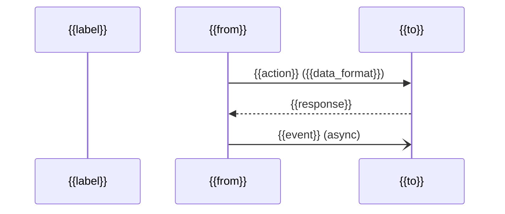

# Diagram Section Templates

Select the template matching the target diagram level. Fill every `{{placeholder}}` — leave none blank.

---

## L1 — System Context

```markdown
## Level 1 — System Context: {{system_name}}

> **Audience**: Stakeholders, Product Managers, Everyone
> **SDLC Phase**: {{sdlc_phase}}

{{narrative: what the system does, who uses it, key external dependencies.}}

```mermaid
C4Context
  title System Context — {{system_name}}

  Person({{alias}}, "{{label}}", "{{description}}")
  System({{alias}}, "{{system_name}}", "{{description}}")
  System_Ext({{alias}}, "{{label}}", "{{description}}")

  Rel({{from}}, {{to}}, "{{verb}}", "[{{protocol}}]")
```

### Element Inventory

| Element | Type | Description |
|---------|------|-------------|
| {{name}} | Person / System / System_Ext | {{description}} |

### Key Observations

- {{notable dependency, risk, or assumption}}
```

---

## L2 — Container

```markdown
## Level 2 — Container Diagram: {{system_name}}

> **Audience**: Developers, Architects, DevOps
> **SDLC Phase**: {{sdlc_phase}}

{{narrative: main containers, responsibilities, communication patterns.}}

```mermaid
C4Container
  title Container Diagram — {{system_name}}

  Person({{alias}}, "{{label}}", "")

  System_Boundary(sb, "{{system_name}}") {
    Container({{alias}}, "{{label}}", "{{technology}}", "{{description}}")
    ContainerDb({{alias}}, "{{label}}", "{{technology}}", "{{description}}")
    ContainerQueue({{alias}}, "{{label}}", "{{technology}}", "{{description}}")
  }

  System_Ext({{alias}}, "{{label}}", "{{description}}")

  Rel({{from}}, {{to}}, "{{verb}}", "[{{protocol}}]")
```

### Container Inventory

| Container | Type | Technology | Responsibility |
|-----------|------|------------|----------------|
| {{name}} | Web App / API / DB / Queue / Worker | {{tech}} | {{responsibility}} |

### Architectural Decisions

- {{decision and rationale}}
```

---

## L3 — Component

```markdown
## Level 3 — Component Diagram: {{container_name}}

> **Container**: {{container_name}} | **Technology**: {{stack}}
> **Audience**: Developers on this service
> **SDLC Phase**: {{sdlc_phase}}

{{narrative: internal structure and architecture pattern used.}}

```mermaid
C4Component
  title Component Diagram — {{container_name}}

  Container_Boundary(cb, "{{container_name}}") {
    Component({{alias}}, "{{label}}", "{{type}}: {{technology}}", "{{description}}")
  }

  ContainerDb({{alias}}, "{{label}}", "{{technology}}", "")
  Container({{alias}}, "{{label}}", "{{technology}}", "")

  Rel({{from}}, {{to}}, "{{verb}}", "[{{method}}]")
```

### Component Inventory

| Component | Type | Responsibility |
|-----------|------|----------------|
| {{name}} | Controller / Service / Repository / Gateway / ... | {{responsibility}} |

### Design Patterns

- {{pattern and rationale}}
```

---

## Deployment

```markdown
## Deployment Diagram: {{system_name}} — {{environment}}

> **Audience**: DevOps, SREs, Platform Engineers
> **SDLC Phase**: Deployment | Maintenance

{{narrative: where it runs, scaling approach, key managed services.}}

```mermaid
C4Deployment
  title Deployment — {{system_name}} ({{environment}})

  Deployment_Node({{alias}}, "{{cloud}} {{region}}", "{{provider}}") {
    Deployment_Node({{alias}}, "{{compute_label}}", "{{compute_tech}}") {
      Container({{alias}}, "{{label}}", "{{technology}}", "")
    }
    Deployment_Node({{alias}}, "{{db_label}}", "{{db_tech}}") {
      ContainerDb({{alias}}, "{{label}}", "{{technology}}", "")
    }
  }

  Rel({{from}}, {{to}}, "{{verb}}", "{{protocol}}:{{port}}")
```

### Infrastructure Inventory

| Node | Type | Provider / Version | Purpose |
|------|------|--------------------|---------|
| {{name}} | Cluster / VM / Managed DB / CDN | {{tech}} | {{purpose}} |

### Scaling & Resilience

- {{scaling config, HA setup, backup policy}}

### Environment Differences

| Aspect | Production | Staging | Dev |
|--------|-----------|---------|-----|
| {{aspect}} | {{prod}} | {{staging}} | {{dev}} |
```

---

## Dynamic (Sequence)

```markdown
## Dynamic Diagram: {{flow_name}}

> **Use Case**: {{short description}}
> **Audience**: Developers, QA Engineers
> **SDLC Phase**: Development | Testing

{{narrative: what flow is traced and why it is architecturally significant.}}



### Flow Steps

| # | From | To | Action | Notes |
|---|------|----|--------|-------|
| 1 | {{from}} | {{to}} | {{action}} | {{note}} |

### Error Cases

- **{{error name}}**: {{trigger}} → {{system response}}

### Suggested Test Cases

- [ ] Happy path end-to-end
- [ ] {{specific failure scenario}}
```
