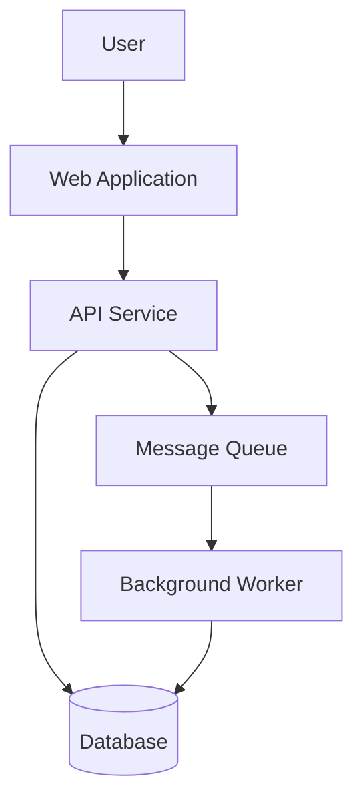
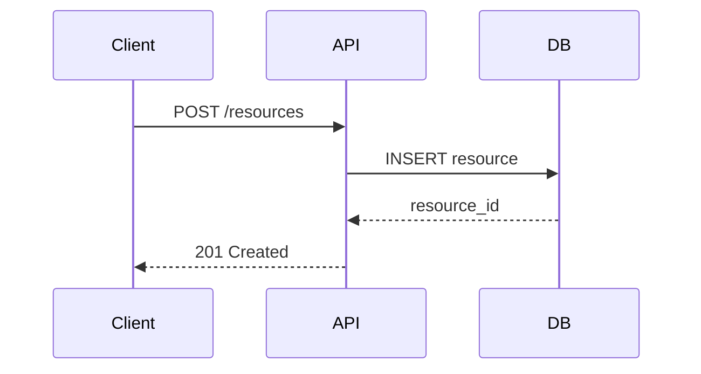

# Authoring Architecture Docs Action

Produces architecture decision records, design documents, and system architecture overviews — the understanding-oriented quadrant of the Diátaxis framework.

**Load `authoring-technical-docs` first** for the multi-pass workflow, style rules, and quality framework. This action provides the templates and architecture-specific rules.

---

## Template: Architecture Decision Record (ADR)

ADRs capture the "why" behind technical decisions. They preserve context that is otherwise lost.

```markdown
---
title: "ADR-[number]: [Short decision title]"
doc-type: explanation
status: [proposed | accepted | deprecated | superseded by ADR-XXX]
date: [YYYY-MM-DD]
decision-makers: [List of people involved]
---

# ADR-[number]: [Short decision title]

## Status

[Proposed | Accepted | Deprecated | Superseded by [ADR-XXX](link)]

## Context

[The situation requiring a decision. What problem? What constraints? What forces? Be specific — include numbers, timelines, technical constraints.]

## Decision

We will [decision].

[Elaborate: what does this mean concretely?]

## Consequences

### Positive

- [Benefit 1]

### Negative

- [Trade-off 1]

### Neutral

- [Side effect that is neither clearly good nor bad]

## Alternatives considered

### [Alternative 1]

[What it was and why it was rejected.]

## References

- [Link to related ADRs, design docs, or external resources]
```

---

## Template: Design document

```markdown
---
title: "[Feature/System] design document"
doc-type: explanation
status: [draft | under review | approved | implemented]
date: [YYYY-MM-DD]
---

# [Feature/System] design document

## Summary

[One paragraph: what this proposes and why. A busy engineer decides whether to keep reading based on this paragraph alone.]

## Goals and non-goals

### Goals

- [What this design aims to achieve]

### Non-goals

- [What this design explicitly does NOT address]

## Background

[Context needed to understand the proposal. Current system state, relevant history, user needs.]

## Detailed design

### Overview

[High-level description. Include a system diagram if helpful.]

### [Component / aspect 1]

[Detailed description. Data models, API contracts, algorithms.]

### Data model

[If applicable: schema definitions, entity relationships, migration plan.]

## Security considerations

[Authentication, authorization, data privacy, encryption, threat model.]

## Performance considerations

[Expected load, latency requirements, scaling strategy.]

## Testing strategy

[Unit tests, integration tests, load tests, rollback plan.]

## Migration / rollout plan

[How to get from current state to proposed state.]

## Open questions

- [Question that still needs answering before implementation]

## Appendix

[Supporting data, benchmarks, reference implementations.]
```

---

## Template: System architecture overview

```markdown
---
title: "[System name] architecture overview"
doc-type: explanation
audience: [new team members | architects | external integrators]
last-updated: [YYYY-MM-DD]
---

# [System name] architecture overview

## What [system name] does

[2-3 sentences: the system's purpose in business terms, not technical terms.]

## Architecture diagram

[Mermaid diagram]

## Components

### [Component 1]

- **Purpose:** [What it does]
- **Technology:** [Language, framework, infrastructure]
- **Owns:** [What data or functionality it's responsible for]
- **Communicates with:** [Other components and how]

## Data flow

1. [User/system initiates action]
2. [Component A receives and processes]
3. [Component A sends to Component B via protocol]

## Infrastructure

| Resource | Provider | Purpose |
|----------|----------|---------|
| [Database] | [AWS RDS] | [Primary data store] |

## Key technical decisions

[Link to relevant ADRs.]

## Known limitations

[Current constraints, tech debt, fragile areas.]
```

---

## Architecture docs rules

1. **Separate "what is" from "what should be."** Overviews describe current state. Design docs describe proposed future.
2. **Diagrams are not optional.** Use Mermaid — it's version-controllable.
3. **Include the "why."** Link to ADRs.
4. **Write for the new team member.**
5. **Be honest about trade-offs.** Every architecture has weaknesses. Document them.
6. **Link to code.** When describing a component, link to the relevant repo or entry point.

---

## Using Mermaid for diagrams

**System overview:**


**Sequence diagram:**


Save ADRs to `docs/architecture/adr-NNN-title.md`. Save design docs to `docs/architecture/design-title.md`.
