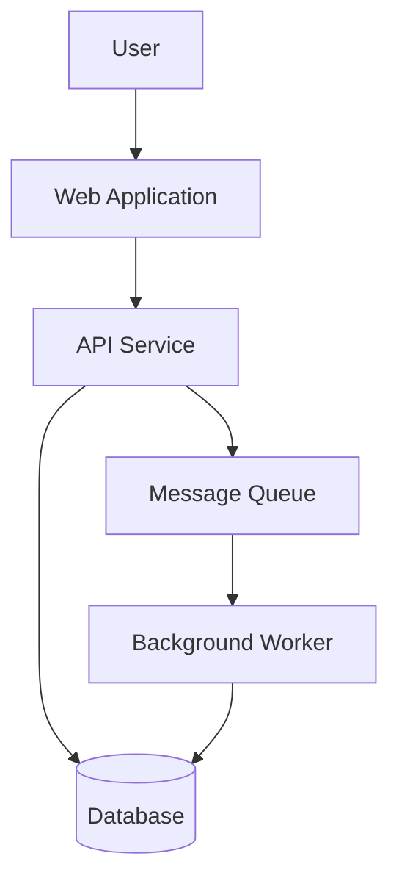
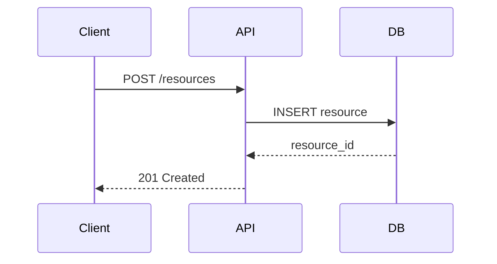

# Authoring Architecture Docs Action

Produces architecture decision records, design documents, and C4 Model diagrams scoped to the appropriate level for the current SDLC phase and audience — the understanding-oriented quadrant of the Diátaxis framework.

**Load `authoring-technical-docs` first** for the multi-pass workflow, style rules, and quality framework. This action provides the templates and architecture-specific rules.

---

## References

Read these before executing any step.

| File | Contains |
|------|----------|
| `references/notation.md` | C4 abstractions, Mermaid element types, verb bank |
| `references/level-rules.md` | Per-level rules and forbidden elements |
| `references/sdlc-mapping.md` | SDLC phase → diagram selection, audience decision tree |
| `references/anti-patterns.md` | Mistakes to detect and avoid |

## Assets

Use these as output scaffolding.

| File | Use for |
|------|---------|
| `assets/architecture-doc.md` | Top-level ARCHITECTURE.md structure |
| `assets/diagram-templates.md` | Per-level section templates (fill in placeholders) |

---

## Workflow

### Step 1 — Read references

Read all four files in `references/` before any other action.

### Step 2 — Gather project context

Extract from input. Ask only if a required field is missing.

| Field | Required for |
|-------|-------------|
| System name and purpose | All levels |
| Users / personas | L1+ |
| External integrations | L1+ |
| Tech stack | L2+ |
| SDLC phase | Selecting diagram levels |
| Target container name + source structure | L3 only |
| Flow name and step-by-step description | Dynamic only |

### Step 3 — Select diagram levels

Consult `references/sdlc-mapping.md` → Phase Matrix and Audience Decision Tree.
State the selection and rationale before proceeding.

### Step 4 — Produce each diagram

For each selected level, in order:

1. Open `assets/diagram-templates.md` and copy the matching template section
2. Fill every `{{placeholder}}` — leave none blank
3. Apply all rules from `references/level-rules.md` for that level
4. Scan output against `references/anti-patterns.md`
5. Self-check against the Review Checklist in `assets/architecture-doc.md`

### Step 5 — Assemble output document

Open `assets/architecture-doc.md` as the document scaffold.
Insert completed diagram sections in level order: L1 → L2 → L3 → Deployment → Dynamic.
Complete the Key Architectural Decisions table and Change Log.

### Step 6 — Save files

```
docs/architecture/ARCHITECTURE.md
docs/architecture/diagrams/context.mermaid
docs/architecture/diagrams/container.mermaid
docs/architecture/diagrams/component-{{container_name}}.mermaid
docs/architecture/diagrams/deployment.mermaid
docs/architecture/diagrams/dynamic-{{flow_name}}.mermaid
```

Save only the files corresponding to the levels actually produced.

---

## Inputs

- Project description, README, or source code
- SDLC phase (required)
- Target container name and source structure (L3 only)
- Flow name and steps (Dynamic only)

## Outputs

- `ARCHITECTURE.md` — full assembled documentation package
- `diagrams/*.mermaid` — one file per diagram level produced

---

## Using Mermaid for diagrams

**System overview:**


**Sequence diagram:**

